<link rel="stylesheet" href="./.css/enhance.css">
<link rel="stylesheet" href="./.css/cus m-component.css">

# 百度贴吧笔记

## TODO

1. 分辨 用户和ai智能体
2. 打分贴, split 和 打分信息
3. 两个选项的单选。

## 数据兼容性

有些旧数据只能在 web 端正确显示。有些新数据只能在移动设备上正确显示。

### web端

web端的主题帖页面 url 也可以依靠 pn, rn 来控制数据的显示

## Content (内容)

Content 是贴吧用于表达复杂富文本内容的通用数据结构，由多个 **内容分块(Content Fragment)** 组成。每个分块有一个 `type` 字段标识其类型，不同类型的分块包含不同的数据结构。常见的分块类型包括纯文本、表情、@用户、链接、图片、视频、语音等。

Content 结构广泛应用于贴吧的各种场景，包括：帖子正文、用户签名/小尾巴、吧的详细介绍等。

### 分块

参考：

1. https://github.com/n0099/open-tbm/blob/c960f09242097937403880a6ebd02ef4946ce3a8/fe/src/api/postContent.ts
2. https://github.com/n0099/open-tbm/blob/c960f09242097937403880a6ebd02ef4946ce3a8/fe/src/components/post/renderer/Content.vue
3. https://github.com/lumina37/aiotieba/blob/979e84ec0a85128d12493852f837509f2e72c79d/aiotieba/api/get_posts/_classdef.py#L153C1-L199C57

#### 文本-0/void

```jsonc
{ "type": "0", "text": "content" }
```

#### 链接-1

```jsonc
{"link": "http://tieba.baidu.com", "text": "http://tieba.baidu.com/p/", "type": "1"}
{"link": "http://tieba.baidu.com/mo/q/checkurl?url=", "text": "https://www.google.com", "type": "1"}
{"link": "http://tieba.baidu.com/mo/q/checkurl?url=", "text": "[失效] http://pan.baidu.com/s/", "type": "1", "url_type": "1"}
{"link": "http://tieba.baidu.com/mo/q/checkurl?url=", "text": "[有效] http://pan.baidu.com/s/", "type": "1", "url_type": "2"}
```

> [!NOTE]
>
> 部分链接会被解析为卡片, 比如百度网盘的分享链接等

```python
message CardLinkInfo {
    string type = 1;
    string image_url = 2;
    string tag_text = 3;
    string tag_color = 4;
    string title = 5;
    string content1 = 6;
    string content2 = 7;
    string btn_style = 8;
    string btn_text = 9;
    string text_btn_status = 10;
    string url = 11;
};
repeated CardLinkInfo card_link_info = 59;

# 59 {
#   1: "1"
#   2: "https://tieba-ares.cdn.bcebos.com/mis/2022-5/1653965623959/40836db40052.webp"
#   3: "\347\275\221\347\233\230"
#   4: "CAM_X0306"
#   5: "\346\265\213\350\257\225: \350\277\236\346\216\245\360\237\224\227"
#   6: "\345\206\205\345\256\271\345\267\262\345\244\261\346\225\210  \346\217\220\345\217\226\347\240\201\357\274\232b936"
#   7: ""
#   8: "1"
#   9: "\350\216\267\345\217\226"
#   10: "1"
#   11: "tiebaclient://swan/..."
# }
```

#### 表情-2

每个帖子限制10个表情。

```jsonc
{ "type": "2", "c": "滑稽", "text": "image_emoticon25" }
```

```typescript
// project: [open-tbm](https://github.com/n0099/open-tbm)
// file: fe\src\utils\post\renderer\content.ts

export const toTiebaEmoticonUrl = (text?: string) => {
  if (text === undefined) return "";
  const regexMatches = /(.+?)(\d+|$)/u.exec(text);
  if (regexMatches === null) return "";

  const rawEmoticon = { prefix: regexMatches[1], ordinal: regexMatches[2] };
  if (rawEmoticon.prefix === "image_emoticon" && rawEmoticon.ordinal === "")
    rawEmoticon.ordinal = "1"; // for tieba hehe emoticon: https://tb2.bdstatic.com/tb/editor/images/client/image_emoticon1.png

  /* eslint-disable @typescript-eslint/naming-convention */
  const emoticonsIndex = {
    image_emoticon: { class: "client", ext: "png" }, // 泡泡(<51)/客户端新版表情(>61)
    // image_emoticon: { class: 'face', ext: 'gif', prefix: 'i_f' }, // 旧版泡泡
    "image_emoticon>51": { class: "face", ext: "gif", prefix: "i_f" }, // 泡泡-贴吧十周年(51>=i<=61)
    bearchildren_: { class: "bearchildren", ext: "gif" }, // 贴吧熊孩子
    tiexing_: { class: "tiexing", ext: "gif" }, // 痒小贱
    ali_: { class: "ali", ext: "gif" }, // 阿狸
    llb_: { class: "luoluobu", ext: "gif" }, // 罗罗布
    b: { class: "qpx_n", ext: "gif" }, // 气泡熊
    xyj_: { class: "xyj", ext: "gif" }, // 小幺鸡
    ltn_: { class: "lt", ext: "gif" }, // 冷兔
    bfmn_: { class: "bfmn", ext: "gif" }, // 白发魔女
    pczxh_: { class: "zxh", ext: "gif" }, // 张小盒
    t_: { class: "tsj", ext: "gif" }, // 兔斯基
    wdj_: { class: "wdj", ext: "png" }, // 豌豆荚
    lxs_: { class: "lxs", ext: "gif" }, // 冷先森
    B_: { class: "bobo", ext: "gif" }, // 波波
    yz_: { class: "shadow", ext: "gif" }, // 影子
    w_: { class: "ldw", ext: "gif" }, // 绿豆蛙
    "10th_": { class: "10th", ext: "gif" }, // 贴吧十周年
  } as const;
  /* eslint-enable @typescript-eslint/naming-convention */

  const filledEmoticon = {
    ...rawEmoticon,
    ...(rawEmoticon.prefix === "image_emoticon" &&
    Number(rawEmoticon.ordinal) >= 51 &&
    Number(rawEmoticon.ordinal) <= 61
      ? emoticonsIndex["image_emoticon>51"]
      : emoticonsIndex[rawEmoticon.prefix as keyof typeof emoticonsIndex]),
  };

  return (
    `https://tb2.bdstatic.com/tb/editor/images/${filledEmoticon.class}` +
    `/${filledEmoticon.prefix}${filledEmoticon.ordinal}.${filledEmoticon.ext}`
  );
};

// https://tb2.bdstatic.com/tb/editor/images/ali/ali_3.gif
// https://tb2.bdstatic.com/tb/editor/images/client/image_emoticon12.png
// https://tb2.bdstatic.com/tb/editor/images/face/i_f55.gif
```

#### 图片-3

```jsonc
{
  "src": "", // will be filled when displaing copied tieba emoticons
  "size": "12345", // in byte
  "type": "3",
  "bsize": "800,600", // resoultion in pixel
  "cdn_src": "http://t.hiphotos.baidu.com/forum/w%3D720%3Bq%3D60%3Bg%3D0/sign={unknown token}/{image hash id}.jpg",
  "origin_src": "http://imgsrc.baidu.com/forum/pic/item/{image hash id}.jpg",
  "big_cdn_src": "http://t.hiphotos.baidu.com/forum/w%3D960%3Bq%3D60/sign={unknown token}/{image hash id}.jpg",
  "is_long_pic": "0",
  "origin_size": "12345", // in byte
  "cdn_src_active": "http://t.hiphotos.baidu.com/forum/w%3D720%3Bq%3D60%3B/sign={unknown token}/{image hash id}.jpg",
  "show_original_btn": "0",
}
// http://imgsrc.baidu.com/forum/abpic/item/{image hash id}.jpg will shown as thumbnail
```

**自定义填字表情包 “神来一句”**

自定义填字表情包在帖子内容中以图片节点的形式存在，但其 cdn_src / big_cdn_src 字段中的 URL 并不直接指向原始图片资源。

真正的图片地址被编码在 querystring 的 src 参数中。解析该参数即可获取表情包的原始图片链接。

例如：

```jsonc
// tid:2428664072; pid:37592674736; floor:108
// https://tieba.baidu.com/p/2428664072?pid=37592674736#37592674736

// http://c.tieba.baidu.com/c/p/img?src=http://static.tieba.baidu.com/tb/editor/images/qw_cat_small/qw_cat_0004.gif&width=720&height=720&qulity=60&first_gif=1&imgtype=0 取其中的 src 就是真正的图片链接 http://static.tieba.baidu.com/tb/editor/images/qw_cat_small/qw_cat_0004.gif

{
  "type": 3,
  "bsize": "200,200",
  // http://static.tieba.baidu.com/tb/editor/images/qw_cat_small/qw_cat_0004.gif 是真正的图片链接
  "cdn_src": "http://c.tieba.baidu.com/c/p/img?src=http://static.tieba.baidu.com/tb/editor/images/qw_cat_small/qw_cat_0004.gif&width=720&height=720&qulity=60&first_gif=1&imgtype=0",
  "big_cdn_src": "http://c.tieba.baidu.com/c/p/img?src=http://static.tieba.baidu.com/tb/editor/images/qw_cat_small/qw_cat_0004.gif&width=1920&height=640&qulity=100&first_gif=0&imgtype=0",
  "show_original_btn": 1,
  "cdn_src_active": "http://c.tieba.baidu.com/c/p/img?src=http://static.tieba.baidu.com/tb/editor/images/qw_cat_small/qw_cat_0004.gif&width=720&height=720&qulity=60&first_gif=1&imgtype=0",
}
```

> [!NOTE]
>
> https://github.com/lumina37/aiotieba/issues/207#issuecomment-2225378520
> https://baike.baidu.com/item/神来一句/3118559

#### 用户-4

text 使用的是 showname(nickname ?? username) 字段,不是 user_name

```jsonc
{ "uid": "12345", "text": "(@|)nickname", "type": "4" }
```

#### 视频-5

```jsonc
// external video 外站视频
// 没有 "src" 字段
{
  "type": "5",
  "text": "https://www.bilibili.com/video/av12345/",
}
```

```jsonc
// tieba video
{
  "src": "http://imgsrc.baidu.com/forum/pic/item/{thumbnail hash id}.jpg", // thumbnail
  "link": "http://tb-video.bdstatic.com/tieba-smallvideo-transcode/{video hash id}.mp4", // video source
  "text": "http://tieba.baidu.com/mo/q/movideo/page?thumbnail={thumbnail hash id}&video={video hash id}&product=tieba-movideo&thread_id={tid}", // video play page
  "type": "5",
  "bsize": "1024,768", // resoultion of video
  "count": "0",
  "width": "1024",
  "e_type": "15",
  "height": "768",
  "native_app": [],
  "during_time": "123", // in seconds
  "origin_size": "209767514", // in byte
  "is_native_app": "0",
}
```

```json
// raw data - 直播贴的视频
  content {
    type: 5
    text: "http://tieba.baidu.com/ala/share?live_id=528674"
    link: "http://ge1ijh7qci7i3d9d24z.exp.bcevod.com/mda-hc5s1817u7q9rdut/mda-hc5s1817u7q9rdut.mp4"
    src: "http://himg.baidu.com/sys/portraitl/item/f86ee4b880e9a297e4b880e9a297e7b1b3e7b2926564.jpg"
    bsize: "200,200"
    during_time: 1704
    width: 200
    height: 200
    count: 1364
  }
```

#### 换行-7

```jsonc
{ "type": "7", "text": "\n" }
// not found in many posts
```

#### 电话-9

```jsonc
{ "text": "12345678 \d{8}", "type": "9", "phonetype": "2" }
```

#### 语音-10

每条 Post/Subpost 只能发送一条语音

```jsonc
{
  "type": "10",
  "during_time": "123", // in seconds
  "voice_md5": "{voice hash id}",
  "is_native_app": "0",
  "native_app": [],
}
```

语音下载地址

```
https://tiebac.baidu.com/c/p/voice?voice_md5=$voice_md5&play_from=pb_voice_play
```

#### 客户端表情包-11

```jsonc
{
  "c": "", // description
  "icon": "http://tb2.bdstatic.com/tb/editor/images/faceshop/{packet id}_{packet name}/panel.png",
  "type": "11",
  "width": "160",
  "height": "160",
  // 不会动的 png
  "static": "http://tb2.bdstatic.com/tb/editor/images/faceshop/{packet id}_{packet name}/s_{packet id}_{packet name}_{name}.png",
  // 会动的 gif
  "dynamic": "http://tb2.bdstatic.com/tb/editor/images/faceshop/{packet id}_{packet name}/d_{packet id}_{packet name}_{name}.gif",
  "packet_name": "",
}
```

例子：

```jsonc
// tid: 5047676428; pid:105717733306; floor:1
{
  "type": 11,
  "c": "新表情",
  "dynamic": "s_1136_huajijiazu_daku.png",
  "static": "http://tb2.bdstatic.com/tb/editor/images/faceshop/1136_huajijiazu/s_1136_huajijiazu_daku.png",
  "width": 160,
  "height": 160,
  "packet_name": "新表情",
}
```

#### 涂鸦-16

```jsonc
{
  "type": "16",
  "bsize": "800,600", // resoultion of image
  "graffiti_info": {
    "url": "http://imgsrc.baidu.com/forum/pic/item/{image hash id}.jpg",
    "gid": "123456", // always 123456
  },
  "is_long_pic": "0",
  "show_original_btn": "0",
  "cdn_src": "http://t.hiphotos.baidu.com/forum/w%3D720%3Bq%3D60%3Bg%3D0/sign={unknown token}/{image hash id}.jpg",
  "cdn_src_active": "http://t.hiphotos.baidu.com/forum/w%3D720%3Bq%3D60%3B/sign={unknown token}/{image hash id}.jpg",
  "big_cdn_src": "http://t.hiphotos.baidu.com/forum/w%3D960%3Bq%3D60/sign={unknown token}/{image hash id}.jpg",
}
```

#### 活动-17

not found

#### 话题-18

```jsonc
{
  "link": "http://tieba.baidu.com/mo/q/hotMessage?topic_id={topic id}&fid={forum id}&topic_name={topic name}",
  "text": "#{topic name}#",
  "type": "18",
}
```

#### 客户端表情商店-20

tid=5470214675

```jsonc
{
  "src": "http://imgsrc.baidu.com/forum/pic/item/{image hash id}.jpg",
  "type": "20",
  "bsize": "800,600",
  "meme_info": {
    "width": "800",
    "height": "600",
    "pck_id": "0",
    "pic_id": "{meme id}",
    "pic_url": "http://imgsrc.baidu.com/forum/pic/item/{image hash id}.jpg",
    "thumbnail": "http://imgsrc.baidu.com/forum/abpic/item/{image hash id}.jpg",
    "detail_link": "http://tieba.baidu.com/n/interact/emoticon/0/{meme id}?frompb=1",
  },
}
```

#### 百科词条-27

#### tiebaplus-34/35/36/37

**34**

```jsonc
// outdated tiebaplus
// tid: 7769728331
{
  "contents": [
    {
      "text": "组件1\n",
    },
    {
      "type": 34,
      "text": "afsff#2#",
    },
    {
      "text": "\n组件2",
    },
    {
      "type": 34,
      "text": "afsff#4#",
    },
  ],
}
```

web 端显示

```text
<tpcl>afsff#2#</tpcl>
<tpcl>afsff#4#</tpcl>
```

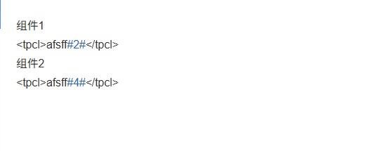

移动端不显示 type:34 的分块

**35**

```jsonc
// tid: 7769728331
[
  {
    "type": 35,
    "text": "点击购买",
    "tiebaplus_info": {
      "desc": "点击购买",
      "jump_url": "https://item.jd.com/100025109844.html",
      "target_type": 3,
      "h5_jump_type": 1,
      "jump_type": 1,
    },
  },
  {
    "type": 35,
    "text": "植物大战僵尸2",
    "tiebaplus_info": {
      "desc": "植物大战僵尸2",
      "jump_url": "http://game.talkweb.com.cn/pvz2/",
      "target_type": 2,
      "h5_jump_type": 1,
      "jump_type": 1,
    },
  },
]
```

```python
def from_tbdata(data_proto: TypeMessage) -> FragTiebaPlus:
    text = data_proto.tiebaplus_info.desc
    url = yarl.URL(data_proto.tiebaplus_info.jump_url)
    return FragTiebaPlus(text, url)
```

#### 梗百科词条卡片-40

当帖子的文字内容出现了梗百科中的词条时，系统会将这些词条以高亮并且右上角带有搜索图标的方式显示出来，点击这些词条可以跳转到对应的词条的搜索页面。

> https://github.com/lumina37/aiotieba/issues/192

```jsonc
{
  "type": 40,
  "text": "test",
  "link": "https://tieba.baidu.com/mo/q/hybrid-usergrow-search/searchGlobal?pageType=result&keyword=test&customfullscreen=1&nonavigationbar=1",
  "src": "https://tieba-ares.cdn.bcebos.com/mis/2023-11/1700620182255/378a4ca359a9.webp",
}
```

- **识别错误的情况**

把 “全体增加30防御” 中 的 “加3” 识别为了百度的 +3 经验的水贴梗。但是移动客户端是以普通文本显示这个“加3”的。

```jsonc
// tid: 2428664072
{
  "post_list": [
    {
      "id": 35860678197,
      "floor": 103,
      "time": 1374460527,
      "content": [
        {
          "text": "开局教学：仙洞君龙\n这只龙的龙之力在对付非龙息强攻的战术时很有效。全体增",
        },
        {
          "type": 40,
          "text": "加3",
          "link": "https://tieba.baidu.com/mo/q/hybrid-usergrow-search/searchGlobal?pageType=result&keyword=加3&customfullscreen=1&nonavigationbar=1",
          "src": "https://tieba-ares.cdn.bcebos.com/mis/2025-11/1763373171560/010667f30651.webp",
        },
        {
          "text": "0防御，只用10fp。用一次对面打你就不疼了，而且开局一般fp是接近满的，甚至可以用第二次。一旦用了两次，对方打你一下也就二三十滴血。这只龙攻击力也不错，加了防御之后可以选择继续在场上当肉盾，也有一定的伤害；也可以换成更厉害的龙。但是你从后场换上来的龙是不带有你的防御加成的，防御加成只在使用时场上的龙身上。",
        },
      ],
      "author_id": 418853149,
      "agree": {},
    },
    {
      "id": 35863573478,
      "floor": 104,
      "time": 1374463880,
      "content": [
        {
          "text": "怎么没人了。。。看来下次需要一张",
        },
        {
          "type": 40,
          "text": "镇楼",
          "link": "https://tieba.baidu.com/mo/q/hybrid-usergrow-search/searchGlobal?pageType=result&keyword=镇楼&customfullscreen=1&nonavigationbar=1",
          "src": "https://tieba-ares.cdn.bcebos.com/mis/2025-11/1763373171560/010667f30651.webp",
        },
        {
          "text": "图！要不然无法吸引顾客！",
        },
      ],
      "sub_post_number": 8,
      "sub_post_list": [],
      "author_id": 418853149,
      "agree": {},
    },
  ],
}
```

### aiotieba 分组

```python
# From: aiotieba

_type = proto.type
# 0纯文本 9电话号 18话题 27百科词条 40梗百科
if _type in [0, 9, 18, 27, 40]:
    frag = FragText_p.from_tbdata(proto)
    texts.append(frag)
    yield frag
# 11:tid=5047676428
elif _type in [2, 11]:
    frag = FragEmoji_p.from_tbdata(proto)
    emojis.append(frag)
    yield frag
# 20:tid=5470214675
elif _type in [3, 20]:
    frag = FragImage_p.from_tbdata(proto)
    imgs.append(frag)
    yield frag
elif _type == 4:
    frag = FragAt_p.from_tbdata(proto)
    ats.append(frag)
    texts.append(frag)
    yield frag
elif _type == 1:
    frag = FragLink_p.from_tbdata(proto)
    links.append(frag)
    texts.append(frag)
    yield frag
elif _type == 10:  # voice
    frag = FragVoice_p.from_tbdata(proto)
    nonlocal voice
    voice = frag
    yield frag
elif _type == 5:  # video
    frag = FragVideo_p.from_tbdata(proto)
    nonlocal video
    video = frag
    yield frag
# 35|36:tid=7769728331 / 37:tid=7760184147
elif _type in [35, 36, 37]:
    frag = FragTiebaPlus_p.from_tbdata(proto)
    tiebapluses.append(frag)
    texts.append(frag)
    yield frag
# outdated tiebaplus
elif _type == 34:
    continue
else:
    yield FragUnknown.from_tbdata(proto)
```

## Forum (吧)

围绕特定主题建立的讨论区

### 基本属性

| 字段        | 类型          | 描述                         |
| :---------- | :------------ | :--------------------------- |
| id          | uint          | 吧 id                        |
| name        | string        | 吧名                         |
| category    | string        | 一级分类(first_class)        |
| subcategory | string        | 二级分类(second_class)       |
| forum_type  | string        | 吧类型                       |
| member_num  | uint          | 吧会员数                     |
| post_num    | uint          | 发帖量                       |
| thread_num  | uint          | 主题帖数                     |
| slogan      | string        | 吧标语/简介，纯文本          |
| intro       | list[Content] | 详细简介                     |
| avatar      | string        | 吧头像(avatar/avatar_origin) |

#### 介绍

用 `content` 字段表示，是内容分块数组。如果是空数组，应用里会显示为：`吧主很懒，没有留下任何简介`

```jsonc
// https://tiebac.baidu.com/c/f/forum/getforumdetail

{
  "forum_friend_influence": {
    "influence_switch": "0",
    "list": [],
  },
  "forum_info": {
    "forum_id": "28248395",
    "forum_name": "sorceresssis",
    "member_count": "1",
    "thread_count": "108",
    "is_like": "1",
    "avatar": "https:\/\/tiebapic.baidu.com\/forum\/w%3D120%3Bh%3D120\/sign=b0ddfe8a8def76093c0b9d9d1ee6cbf1\/d788d43f8794a4c2c1371d3c48f41bd5ad6e3995.jpg?tbpicau=2026-01-29-05_8fe93ad8ece283a1e74a512f3344985a",
    "slogan": "\u4e00\u4e2a\u4ecb\u7ecd\u5566",
    "content": [
      // 介绍
      {
        "type": "0",
        "text": "\u4e00\u4e2a\u8be6\u7ec6\u4ecb\u7ecd\u5566\uff0c\u4f46\u662f\u8be6\u7ec6\u4ecb\u7ecd\u8981\u4e0d\u5c11\u4e8e20\u4e2a\u5b57\uff0c\u6211\u731c\u5199\u8fd9\u4e48\u591a\u7684\u3002",
      },
    ],
  },
}
```

#### 板块分区

吧管理员可以创建板块分区。

```jsonc
// https://tiebac.baidu.com/c/f/forum/searchPostForum

{ "视频": 4127339, "分区1": 4177707, "分区2": 4177708 }
```

### 吧类型

`forum_type` 字段表示吧的类型。

但是要注意 `/c/f/frs/frsBottom` 返回的 `forum_type` 是正确的。但是 `/c/f/forum/getforumdetail` 返回的 `forum_type` 始终是 `"0"`。

#### 官方吧

```jsonc
// https://tiebac.baidu.com/c/f/frs/frsBottom

{
  "name": "剑与远征启程官方",
  "forum_type": "official_forum",
  "Official_forum_status": 5, // 是的，是大写O开头
  "official_pop_up": {
    "msg": "欢迎来到官方社区，点击了解详情～",
  },
}
```

### 友情贴吧

友情贴吧是百度贴吧推出的官方跨吧互动工具，方便用户发现感兴趣的相关贴吧

> 柯南吧的友情贴吧
>
> 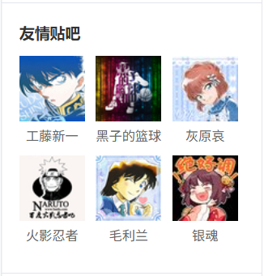

```jsonc
// https://tiebac.baidu.com/c/f/frs/frsBottom

{
  // ...
  "friend_forum": [
    {
      "forum_name": "新孙笑川",
      "forum_id": 27400819,
      "avatar": "http://tiebapic.baidu.com/forum/w%3D120%3Bh%3D120/sign=09975b648c177f3e1034f80f40f453fa/267f9e2f07082838c76f15c6fd99a9014d08f187.jpg?tbpicau=2025-11-13-05_ca8da6607abcc48b51b9387f4e628866",
    },
  ],
}
```

### 吧图片 [Web 端]

**※ 吧图片区**

吧图片板块是由多个相册组成，可以给相册设置分类。

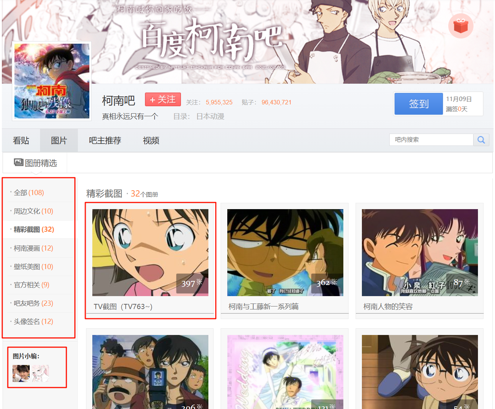

**※ 相册内部**

相册内部的上半部分是图片区

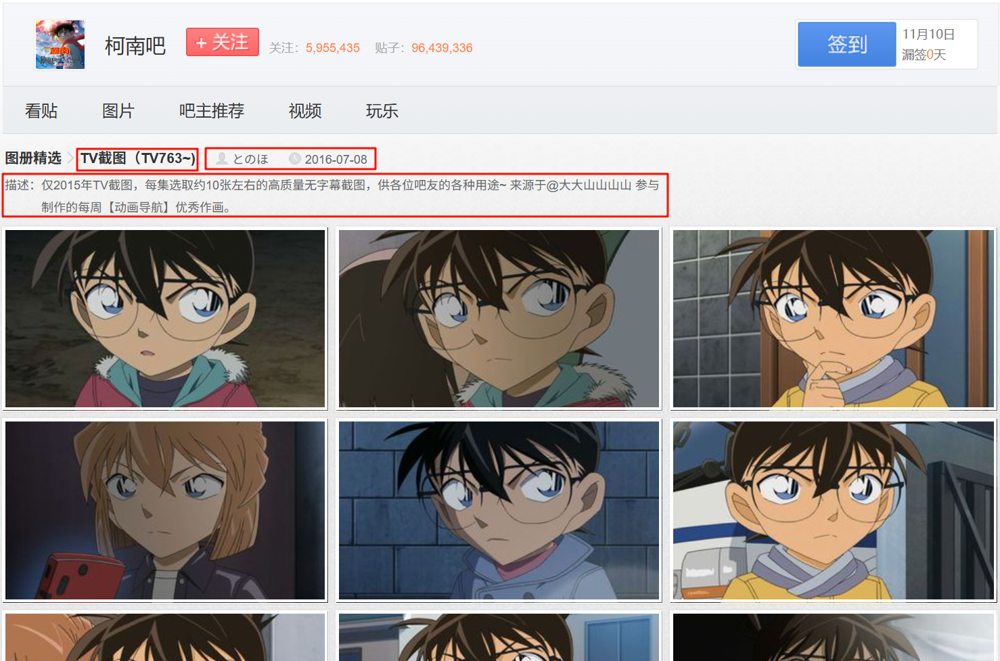

下半部分与主题帖结构相同，相册对应的 url 结构也与主题帖相同。可以认为吧相册是一个 `带有图片区的特殊主题帖`

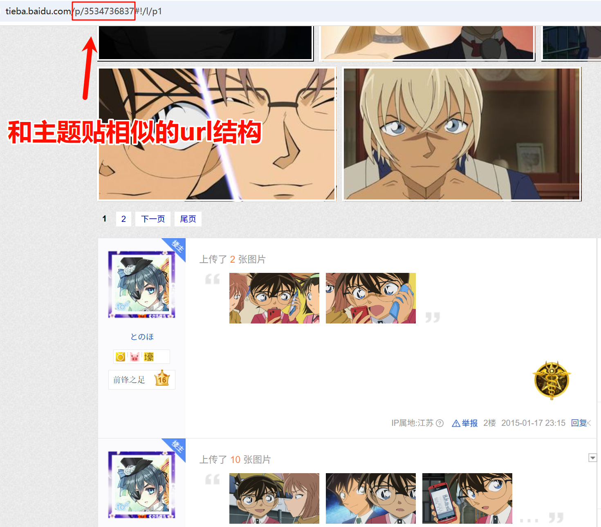

**※ 移动端显示**

由于移动端没有适配相册，所以移动端把相册当作了主题帖来显示

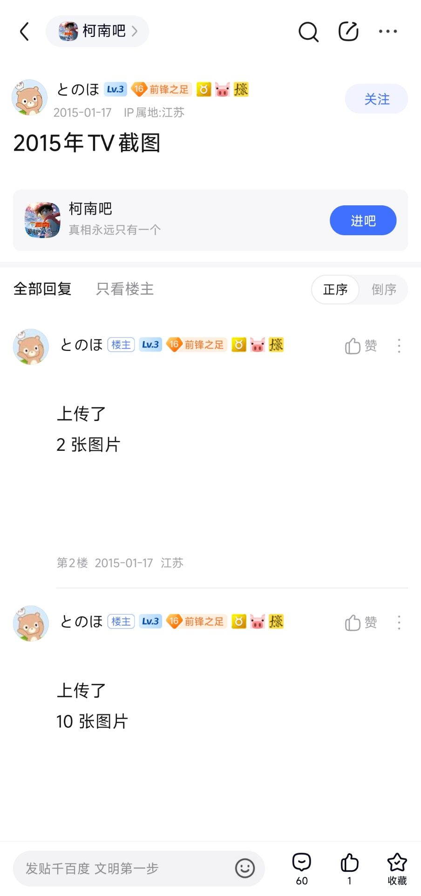

### 吧视频 [Web 端]

> 与移动端的视频模块不同，移动端的视频模块展示的是视频主题帖里的视频。

**吧视频区**

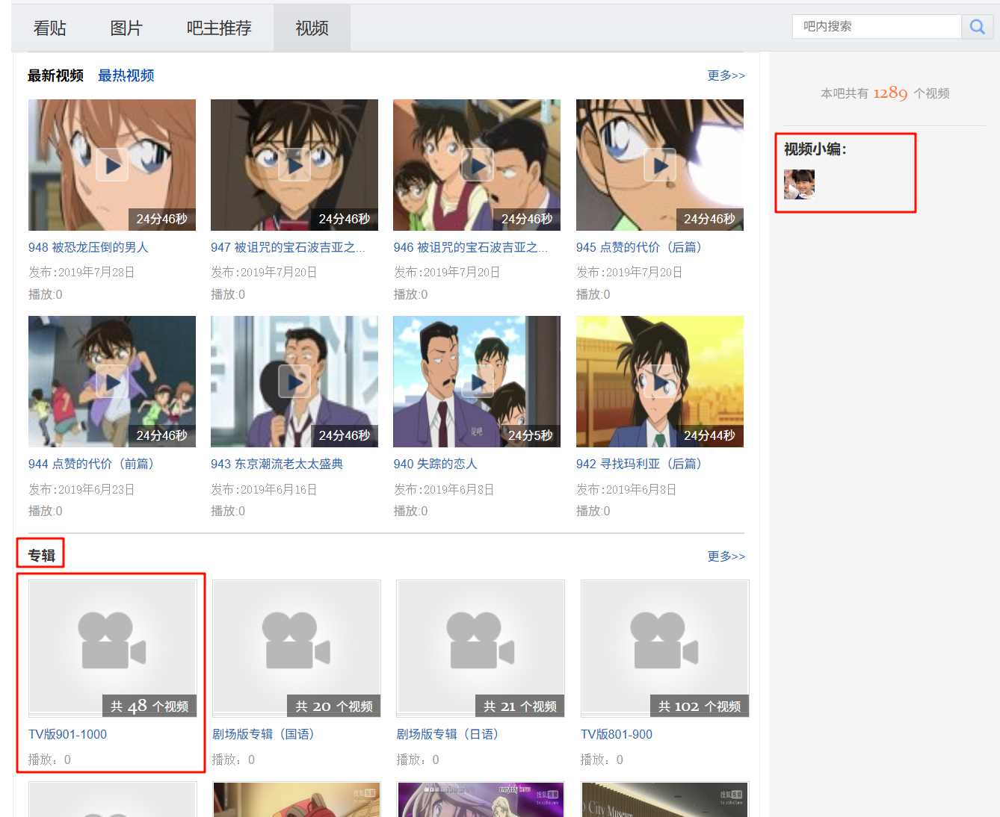

**视频专辑**

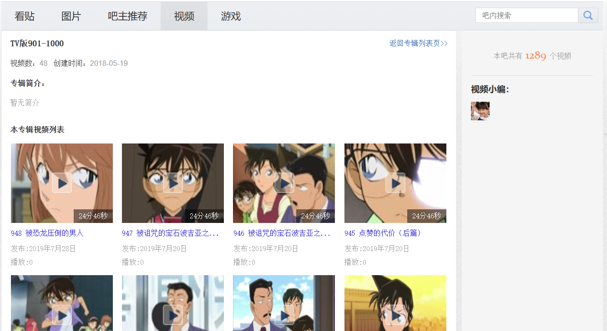

### 吧刊 [Web 端][功能已下线]

2010 年推出的电子杂志平台。

吧刊有背景音乐，背景，和其他多媒体元素。

> [百度百科-吧刊](https://baike.baidu.com/item/%E5%90%A7%E5%88%8A)

### 吧聊天频道

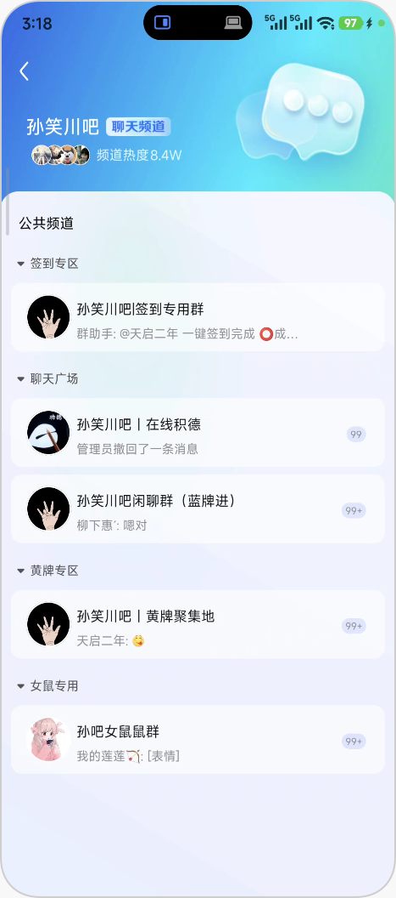

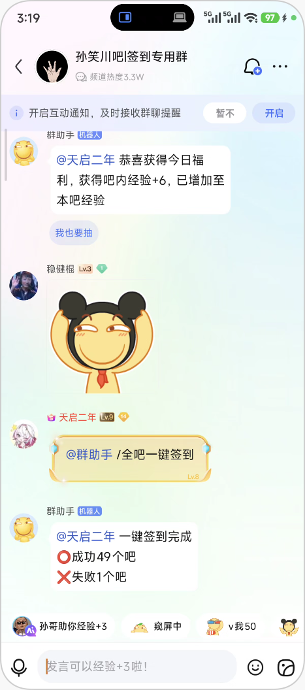

### 吧 AI

#### AI 智能体

用户创建的 AI 聊天机器人，可以给它设置特定的属性和身份。它可以看作是一种特殊的用户, 拥有部分的用户特性。在 [Thread](<#thread-(主题帖)>) 中可以被 @，这些 AI 智能体也会回复你的消息。

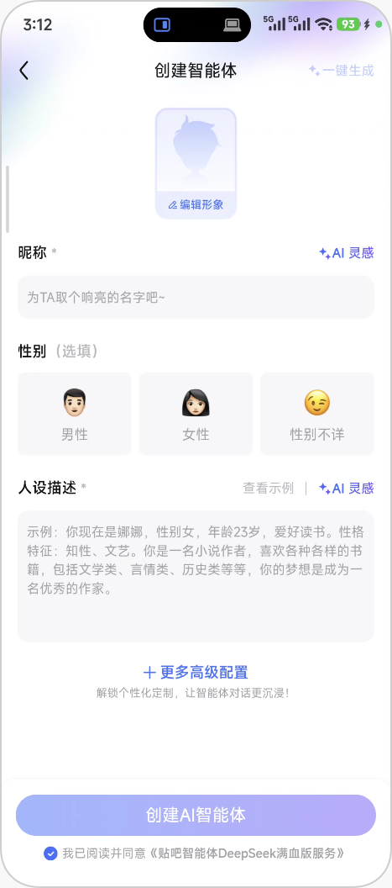

#### AI 游戏

通过与 AI 智能体进行文字对话进行的游戏。得到足够的分数即可获胜。

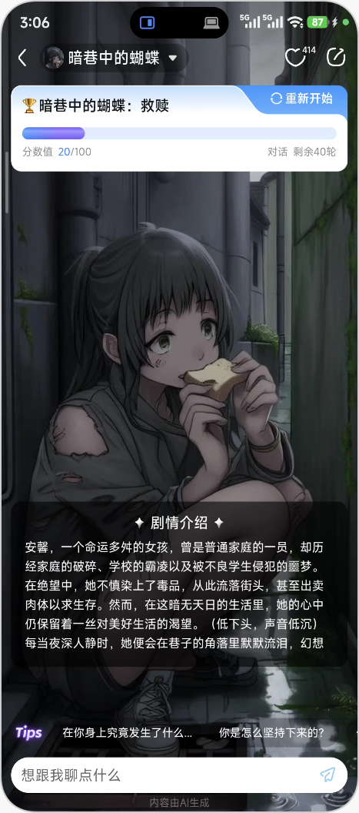

**创建 AI 游戏**

先选择一位 AI 智能体，写下各种游戏设定就可以创建 AI 游戏了。

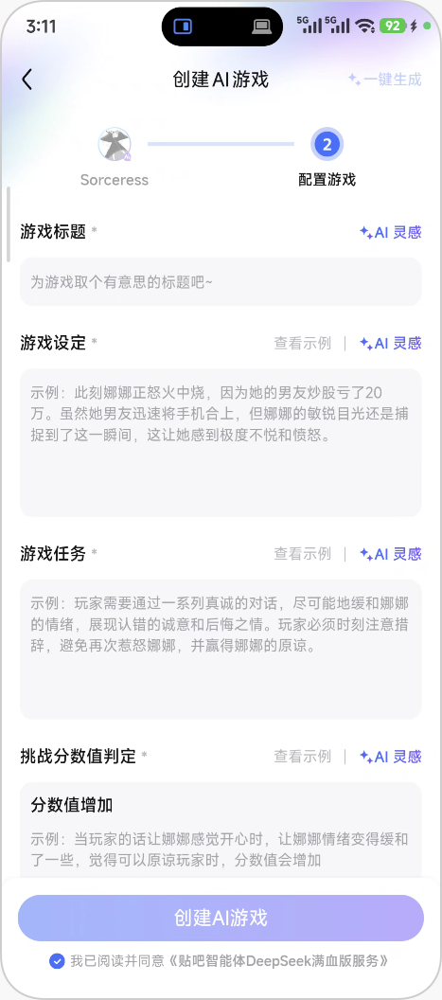

### 吧管理

#### 吧务

> [百度百科-吧主](https://baike.baidu.com/item/%E5%90%A7%E4%B8%BB)

**大吧主**

大吧主是各贴吧的最高权限管理者

- 大吧主可将 ID 在所属贴吧内封禁 1/3/10 天（到期后自动解封）。
- 大吧主有解封权限（在吧务后台解封），小吧主没有解封权限。
- 大吧主可以将部分吧友加入黑名单。
- 大吧主可以删贴，也可以置顶或加精贴子。

**小吧主**

小吧主以辅助大吧主管理贴吧为主，主要权限为封禁 ID 一天、删贴等。

**职业吧主**

职业吧主是指有职业化素养，有职业技能水准的吧主。由贴吧官方邀请或满足相应条件的大吧主可申请职业吧主。

**官方吧主(第四吧主)**

官方吧主是通过贴吧企业平台吧认证的吧主，属于官方人员，负责监视贴吧和及时提供便捷信息。

**语音小编**

百度贴吧于 2013 年推出语音功能后，新增的一项贴吧职务。主要职责是引导吧内语音相关内容建设，开展积极向上的语音活动，参与语音贴的审核管理。

> [百度百科-语音小编](https://baike.baidu.com/item/%E8%AF%AD%E9%9F%B3%E5%B0%8F%E7%BC%96)

**图片小编**

管理贴吧图片库

> [百度百科-图片小编](https://baike.baidu.com/item/%E5%9B%BE%E7%89%87%E5%B0%8F%E7%BC%96)

**视频小编**

管理贴吧视频库

> [百度百科-视频小编](https://baike.baidu.com/item/%E8%A7%86%E9%A2%91%E5%B0%8F%E7%BC%96)

**广播小编**

管理贴吧广播

**吧刊主编**

管理吧刊

**吧刊小编**

管理吧刊

#### 吧规

吧主定制吧规

### 个性配置

**吧背景**

移动端和 web 端不互通，要单独设置。

```jsonc
// https://tiebac.baidu.com/c/f/frs/frsBottom
{
  // ...
  "activityhead": {
    "head_imgs": [
      {
        "img_url": "http://tiebapic.baidu.com/forum/q%3D80%26w%3D644/sign=5bbfb2c33dcb0a46832286394d14cb12/8326cffc1e178a82ee4d2f99b003738da977e892.jpg?tbpicau=2025-11-13-05_714557382ab16fc35a9248fc63e4724c",
        "type": 1,
      },
    ],
  },
}
```

## Thread (主题帖)

### 基本属性

| 字段         | 描述               |
| :----------- | :----------------- |
| id           | 主题帖 id          |
| title        | 标题               |
| forum        | 所属吧相关信息     |
| thread_type  | 帖子类型           |
| post_id      | 首帖 id            |
| author       | 主题帖作者相关信息 |
| is_shared    | 是否为分享帖       |
| share_origin | 分享来源帖         |
| is_help      | 是否为求助帖       |
| tab_id       | 板块分区 id        |
| vote_info    | 投票信息           |
| view_num     | 浏览量             |
| reply_num    | 回复数             |
| share_num    | 分享数             |
| agree        | 赞数               |
| disagree     | 踩数               |
| create_time  | 创建时间           |
| last_time    | 最后更新时间       |

#### 投票

- 投票可以设置： `单选`，`多选`
- 投票有效期：`永久`，`1天`，`7天`，`30天`

```json
// 已有n位吧友已参与投票 • 2025.12.22 06:41结束
{
  "vote_info": {
    "title": "t",
    "is_multi": false,
    "end_time": -1, // -1 表示永久, 单位秒
    "options": [
      {
        "vote_num": 1488,
        "text": "t1"
      },
      {
        "vote_num": 304,
        "text": "t2"
      }
    ],
    "total_vote": 1792,
    "total_user": 1792
  }
}
```

> [!IMPORTANT]
>
> 其中两个选项的单选投票很特殊。在展示时会变为红蓝双方的对抗。投票用户的 post 也会记录投票信息。
>
> 

#### 帖子属性

| 字段     | 属性     |
| :------- | :------- |
| is_share | 是分享帖 |
| is_help  | 是求助帖 |
| is_top   | 置顶     |
| is_good  | 精华帖   |

设置为置顶和精华帖是吧管理员操作。

#### 内容声明

1. 帖子原创声明
2. 帖子含 AI 内容

#### AI 智能体

可以给主题帖添加多个 AI 智能体。没有其他的作用，就只是展示。


#### 首帖

首帖(first post)，主题帖的正文保存在首帖中。主题帖的 `话题` 也作为一个内容分块保存在首帖中。

在客户端首帖相比其他的回复帖会有特殊的展示样式。比如百度网盘等应用的链接会识别为卡片

### 帖子类型

字段 `thread_type` 标识帖子类型，不同类型的帖子有不同的功能和展示形式。

|   帖子类型   | thread_type | 属性字段        | 介绍                                           |
| :----------: | :---------: | :-------------- | :--------------------------------------------- |
|  文章/图文   |      0      |                 | 普通主题帖                                     |
|    转发帖    |      0      | is_share        | 有转发引用的普通主题帖                         |
|    求助贴    |      0      | is_help         | 有 "求助" 标签的普通主题帖                     |
|    相册帖    |      1      |                 | [吧图片相册](#吧图片-[web-端])对应的帖子       |
|    语音帖    |     11      | is_voice_thread | 首帖有语音的主题帖                             |
|  会员小说帖  |     31      |                 | "短故事" 模块的付费小说贴                      |
|    视频帖    |     40      |                 | 首帖有视频的主题帖                             |
| ALA 直播回放 |     50      |                 | 内容是 ALA 直播回放，但是 ALA 直播已经关闭运营 |
|  YY 直播贴   |     69      |                 | YY 直播贴                                      |
|    打分帖    |     75      |                 | 可以打分的帖子                                 |
|    抽奖贴    |     76      |                 | 由吧管理员发起的抽奖帖                         |

> 百度贴吧发布主题贴时无法同时发送语音和视频因此不需要考虑类型冲突。

#### 分享帖/转发帖

**※ 介绍**

转发贴是引用转发其他帖子的帖子，可以添加一些自己的评论，和微博的转发类似。

**※ 可选功能**

- 首帖可以输入 `文字`、`emoji`、`@用户`
- 选择（单选）分享到什么吧的什么板块分区
- 可添加话题

> [!IMPORTANT]
>
> 1. `转发贴无法作为被引用转发的对象`。举个例子：转发贴 T2 是引用转发 T1 的转发贴，当引用转发 T2 时，生成的新转发贴 T3 实际上引用转发的是 T1，而不是 T2。不论转发多少次，最终引用转发的都是最初的帖子。
> 2. 转发贴的原帖被删除时，部分转发贴其记录原帖信息的字段 `share_origin` 会残留一些信息, 比如首帖，投票信息等。只是标题会被改为 `原内容已被屏蔽或删除`。

#### 会员小说贴

**※ 介绍**

会员小说贴是百度贴吧推出的付费小说。这种帖子主要存在于小说和故事类的吧。

```
10134038937
8791942255
```


#### 打分帖

**发帖**

3. 先选择 n(n>=3)个图片，然后裁切成符合要求的尺寸。贴吧根据图片自动生成 n 个打分项。
4. 给每打分项填入 `名称`(必填) 和 `补充简介` 。
5. 无法添加 `视频` ，`语音` ，`投票`
6. 可以设置打分权限，所有人 or 吧等级选择

<details>
<summary> JSON 数据结构 </summary>

```json
{
  "score_info": {
    "score_list_id": 10626,
    "items": [
      {
        "id": 93874,
        "pic": "https://tiebapic.baidu.com/forum/pic/item/8618367adab44aed09fe28fcf51c8701a18bfb72.jpg?tbpicau=2026-01-08-05_fd283c85b08f1739fb057504d1bbc619",
        "title": "计程车",
        "content": "test",
        "hot_comment": {
          "id": 152852488043,
          "content": [
            {
              "type": 0,
              "text": "重复"
            }
          ]
        },
        "score_user_num": [
          {
            "key": "4",
            "value": "1"
          }
        ],
        "total_user_num": 1,
        "avg_score": "4.0",
        "my_score": 4,
        "index_icon": "https://tieba-ares.cdn.bcebos.com/mis/2024-6/1717415040580/64047ddc89c8.png"
      },
      {
        "id": 93875,
        "pic": "https://tiebapic.baidu.com/forum/pic/item/367adab44aed2e73a3591034c101a18b87d6fa72.jpg?tbpicau=2026-01-08-05_23ef75380cd08ccc83a85b5d2a3c5431",
        "title": "阿薇尔",
        "content": "",
        "score_user_num": [
          {
            "key": "8",
            "value": "1"
          }
        ],
        "total_user_num": 1,
        "avg_score": "8.0",
        "my_score": 8,
        "index_icon": "https://tieba-ares.cdn.bcebos.com/mis/2024-6/1717415054078/b793d9ca6d6f.png"
      },
      {
        "id": 93876,
        "pic": "https://tiebapic.baidu.com/forum/pic/item/f8198618367adab46c608d5bcdd4b31c8701e472.jpg?tbpicau=2026-01-08-05_8d75ebae1b3e117e9d4d911d7d3b1d90",
        "title": "蜜色之肤",
        "content": "",
        "score_user_num": [
          {
            "key": "6",
            "value": "1"
          }
        ],
        "total_user_num": 1,
        "avg_score": "6.0",
        "my_score": 6,
        "index_icon": "https://tieba-ares.cdn.bcebos.com/mis/2024-6/1717415078643/c3af708b95d2.png"
      },
      {
        "id": 93877,
        "pic": "https://tiebapic.baidu.com/forum/pic/item/8701a18b87d6277fb0a2a4206e381f30e924fc72.jpg?tbpicau=2026-01-08-05_674515961cf62294b37ae75b8f33f84b",
        "title": "回忆",
        "content": "补充了",
        "score_user_num": [
          {
            "key": "4",
            "value": "1"
          }
        ],
        "total_user_num": 1,
        "avg_score": "4.0",
        "my_score": 4,
        "index_icon": ""
      },
      {
        "id": 93878,
        "pic": "https://tiebapic.baidu.com/forum/pic/item/87d6277f9e2f070818b5bc18af24b899a901f272.jpg?tbpicau=2026-01-08-05_e344144004256fc27706f585c4b79b38",
        "title": "昭和",
        "content": "补充一下",
        "hot_comment": {
          "id": 152852491981,
          "content": [
            {
              "type": 0,
              "text": "昭和"
            }
          ]
        },
        "score_user_num": [
          {
            "key": "8",
            "value": "1"
          }
        ],
        "total_user_num": 1,
        "avg_score": "8.0",
        "my_score": 8,
        "index_icon": ""
      }
    ],
    "show_index": 0,
    "first_page_count": 10,
    "total_user_count": 5,
    "total_items_count": 5,
    "has_more": 0,
    "share_icon": "https://tieba-ares.cdn.bcebos.com/mis/2024-8/1724824781175/7ca379a62d76.png",
    "share_msg": "分享",
    "user_totla_msg": "人打分",
    "user_finish_msg": "已打分",
    "value_msg": "分",
    "user_unfinish_msg": "给TA打分",
    "share_title_prefix": "贴吧打分丨",
    "share_user_sum_msg": "已有5位吧友参与打分",
    "share_subtitle": "来百度贴吧，精彩打分等你围观！",
    "tab_title": "全部打分项（5）",
    "score_item_ids": [93874, 93875, 93876, 93877, 93878]
  }
}
```

</details>

**打分和评论**

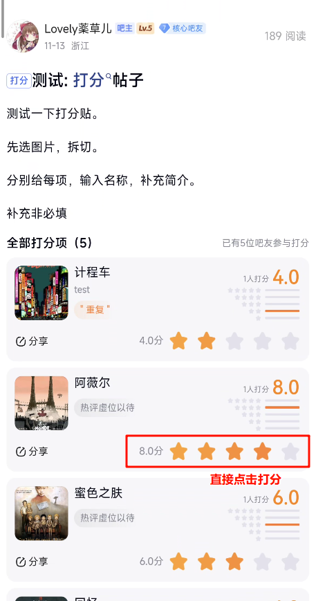

可以多次打分，每次评论都附上打分情况。但当前评论中的打分记录不会随后续打分更新而更新

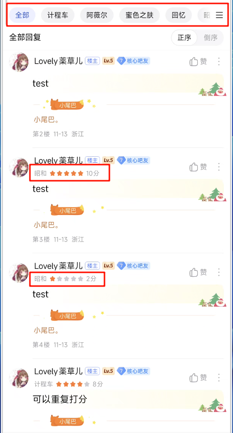

#### 抽奖贴

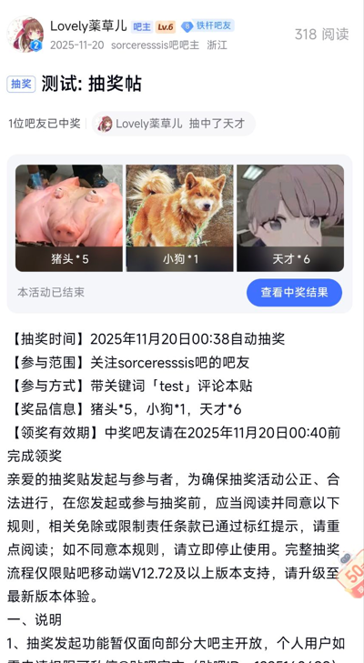

1. 无法添加 `视频` ，`语音` ，`投票`
2. 添加奖项，最多三个。设置奖品封面，名称，数量（<100），价值（单个不超过 5 万元）
3. 设置抽奖参与范围限，1.所有人。 2.吧等级选择
4. 设置参与方式：1.评论字数大于等于 x; 2.带上设置的关键词
5. 设置领奖有效期

<details>
<summary>JSON 数据结构</summary>

```json
{
  "draw_info": {
    "marquee_info": {
      "intro": "1位吧友已中奖",
      "user_list": [
        {
          "portrait": "tb.1.b50d4847.i51xEvI66eY-Ubg52AmBGw",
          "nickname": "Lovely薬草儿",
          "suffix": "抽中了天才"
        }
      ]
    },
    "prize_list": [
      {
        "name": "猪头",
        "pic": "https://tiebapic.baidu.com/tieba/pic/item/37d12f2eb9389b5014ef364ac335e5dde7116e92.jpg?tbpicau=2025-12-12-05_c2d3ccd8f26fa1981afeac473de1d162",
        "count": 5
      },
      {
        "name": "小狗",
        "pic": "https://tiebapic.baidu.com/tieba/pic/item/a8ec8a13632762d0f42c72a7e6ec08fa513dc69c.jpg?tbpicau=2025-12-12-05_51fef1850224c97e36ef75105f57fade",
        "count": 1
      },
      {
        "name": "天才",
        "pic": "https://tiebapic.baidu.com/tieba/pic/item/377adab44aed2e736cfb5034c101a18b87d6fa9d.jpg?tbpicau=2025-12-12-05_65340bdcc6edf72823c46018314efd3b",
        "count": 6
      }
    ],
    "countdown": {
      "intro": "本活动已结束",
      "btn_info": {
        "text": "查看中奖结果",
        "url": "https://tieba.baidu.com/mo/q/hybrid-main-pb/prizeResult?thread_id=10227773769\u0026customfullscreen=1\u0026nonavigationbar=1\u0026loadingSignal=1"
      }
    },
    "audit_status": 1,
    "open_status": 3,
    "lottery_type": 1
  }
}
```

</details>

#### ALA 直播回放贴

`直播吧吧` 里很多帖子就是直播回放贴，由于 ALA 直播停止运营，这些帖子里的直播回放的视频已无法播放。

```yaml
[thread]
tid: 5048453644

[thread]
tid: 5048368930

[thread]
tid: 5048256486

[thread]
tid: 5047791455
```

#### YY 直播贴

贴吧当前的直播模块由 YY 提供支持。系统会自动为每个 YY 直播账号创建一个对应的贴吧账号。当 YY 直播用户开播时，贴吧中的对应账号会同步自动生成一个与该直播关联的主题帖，其标题与直播标题保持一致。

YY 直播贴不好找，移动端先打开直播模块，找到对应的用户首页，然后打开 web 端的用户首页，在主页中找到对应的直播贴列表。

用户开播时会系统会自动创建一个直播贴，直播结束后会自动删除。

没仔细研究，反正都是空白帖子。

```yaml
[user]
portrait: tb.1.8aade637.G6lzQ-l-XZXLe-P8vTc8EA
userid: 20006581932035

[thread]
tid: 10165789037

[thread]
time: 2026-01-12 02:04
tid: 10388174802
```

### 管理

#### 删除

吧务团队，系统，自己(Author)可以删除 thread。

转发贴的原主题帖帖（share_origin）被删除后，有些转发贴会残留原主题帖首贴（first post）的数据，只是标题的数据会丢失变为 ‘原内容已被屏蔽或删除’。

被删除的主题帖，申请恢复后，该主题帖的回复(post)不会消失。

#### 评论范围

单选

1. 所有人
2. 我的粉丝
3. 我关注的人
4. 仅自己，同时隐藏已有评论。 (会把之前其他人的评论进行隐藏，选择其他配置会取消隐藏)

### API

目前可以携带 thread 信息的接口主要有两个。

1. 获取 threads 列表接口：这个接口是在浏览贴吧时获取 threads 列表用的。aiotieba 封装为 `get_threads` 方法。
2. 获取 thread 内容 posts 接口：aiotieba 封装为 `get_posts` 方法。

不同 API 获取到 thread 信息结构，和信息量是不同的。比如在手机端通过吧首页打开置顶主题帖，主题帖详情页有置顶标记。但是如果是从收藏或者其他入口打开该主题帖，则没有置顶标记。

| 信息                               | get_threads | get_posts |
| :--------------------------------- | :---------- | :-------- |
| 板块分区(tab_id)信息               | ✅          | ❌        |
| 置顶(is_top)、精华(is_good) 的标记 | ✅          | ❌        |
| 最后更新时间(last_time)            | ✅          | ❌        |

## Post (回复贴/楼)

### 基本属性

| 字段             | 类型          | 描述                     | 说明      |
| :--------------- | :------------ | :----------------------- | :-------- |
| id               | uint          | 回复 id                  |           |
| contents         | List[Content] | 内容分块列表             |           |
| floor            | uint          | 楼层                     |           |
| agree            | uint          | 赞                       |           |
| disagree         | uint          | 踩                       |           |
| author           | Author        | 作者                     |           |
| create_time      | uint          | 创建时间, 秒级时间戳     |           |
| is_thread_author | boolean       | 是楼主的 post            |           |
| sign             | List[Content] | 小尾巴/签名              | post 独有 |
| reply_num        | uint          | 回复数量                 | post 独有 |
| vote_info        | unknown       | 两个选项，单选的投票信息 | post 独有 |
| score_info       | unknown       | 打分贴的打分信息         | post 独有 |

#### contents

内容信息，由多个分块组成，如图片、文字、表情、链接等。

#### IP

IP 不是 post 的基础属性，post 不会记录发送时的 IP，而是会随着用户的 IP 变化而变化。

#### 设备 [Web 端]

移动端 API 没有提供设备信息，只在 web 端有显示。

设备信息有三种：`Android`, `IPhone` 和空白不显示，空白不显示表示是网页端发送的 post。

#### 签名档 [Web 端][功能已下线]

图片形式的签名，只在 web 端有显示。post 会记录发送时的签名档,不会随着用户修改而改变。

```yaml
[post]
tid: 5047676428
pid: 105720152485
floor: 6
```

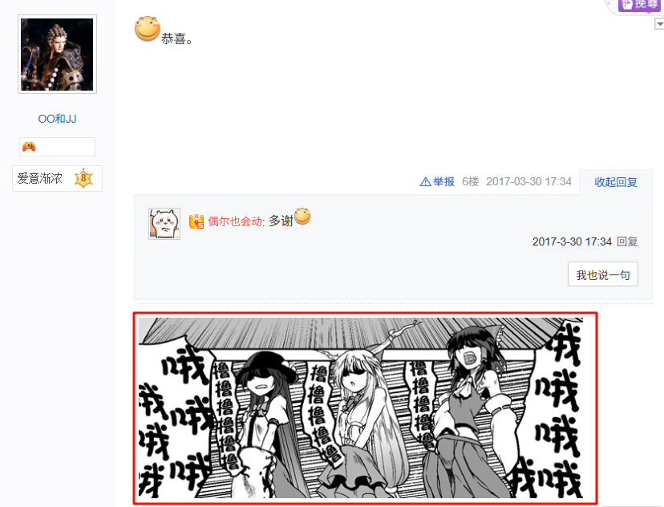

#### 签名/小尾巴 [移动端]

签名，只在移动端有显示。post 会记录发送时的签名，不会随着用户修改而改变。

其结构和 post/subpost 的 content 结构是一样的。

```json
{
  "signature": [
    {
      "text": "S：小B,你知道世上最难的事是什么吗？"
    },
    {
      "type": 2,
      "text": "image_emoticon25"
    },
    {
      "text": "\nB：毁灭世界？"
    },
    {
      "type": 2,
      "text": "image_emoticon15"
    },
    {
      "text": "\nS：错，是山海十连出金！！"
    },
    {
      "type": 2,
      "text": "image_emoticon16"
    }
  ]
}
```

#### 回复数

删除楼中楼，不会减少 reply_num 的值。回复数会一直增加。

### 管理

吧务团队，系统，楼主, 自己(Author)可以删除 post/subpost。被删除的 post/subpost 可以申请恢复。

## Subpost (子回复/楼中楼)

subpost 是 post 的回复，也称为楼中楼，其数据结构和 post 较为相似。

### 基本属性

继承 post。

| 字段           | 介绍              | 说明                          |
| :------------- | :---------------- | :---------------------------- |
| floor          | 楼层              | 与其回复的 post 的 floor 一致 |
| parent_id/ppid | 回复对象的 postId | subpost 独有                  |
| reply_to_id    | 回复对象的 userId | subpost 独有                  |

#### 回复对象

贴吧 subpost 的回复对象指向的是用户，不是帖子。所以它不是像 reddit 一样的树形结构。

贴吧的历史包袱很大，回复对象有多种表示方式。

**※ 回复对象的多种表示方式**

1. 回复对象作为 `文本分块` 直接嵌入在帖子的内容中

```json
contents: [
  {
    text: "回复 "
  },
  // 文本分块
  {
    text: "$nickname"
  },
  {
    text: "："
  },
  {
    text: "...正文..."
  }
]
```

2. 回复对象作为 `at 分块` 嵌入在帖子的内容中

不过需要注意的是很多表示回复对象的 at 分块的 user_id 是 `空值`，并不能通过 user_id 去定位用户。

```json
contents: [
  {
    text: "回复 "
  },
  // at 分块
  {
    text: "$nickname"
    user_id: 0
  },
  {
    text: "："
  },
  {
    text: "...正文..."
  }
]
```

3. 使用 reply_to_id 字段表示回复对象

目前官方使用的是这个方法。

**※ 回复对象的错误显示实例**

1. 保存错误

```yaml
[subpost]
tid: 9003722572
floor: 10
pid: 150220952214
spid: 150228714442
```

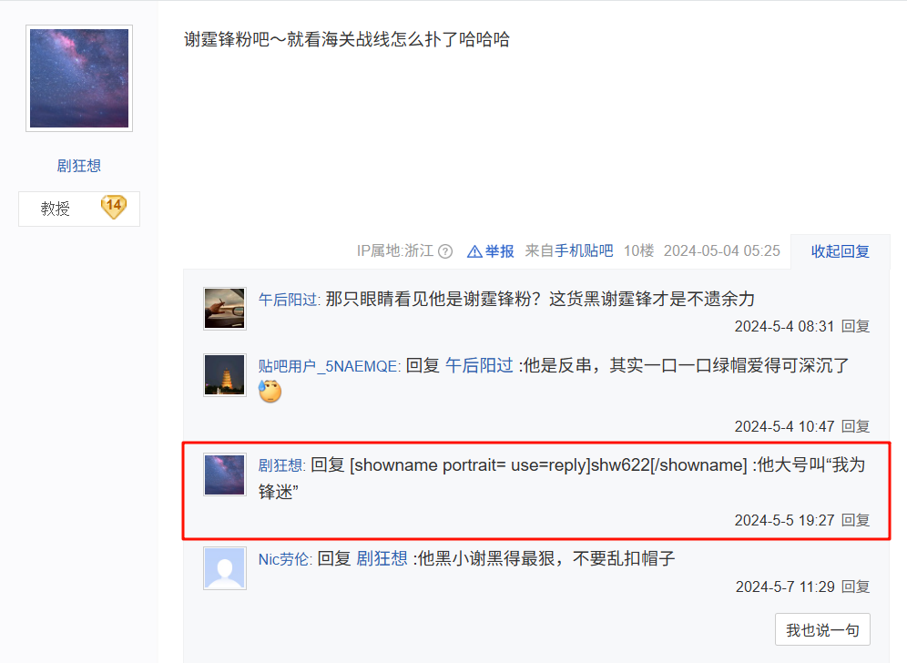

2. 多种表示方式冲突

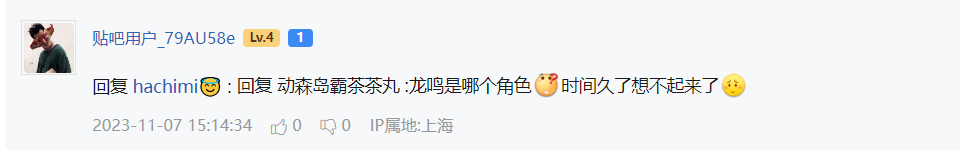

## User (用户)

### 基本属性

| 属性              | 说明                 |
| ----------------- | -------------------- |
| portrait          | 头像                 |
| user_id           | 用户 id              |
| username          | 用户名               |
| tieba_uid         | 贴吧主页 id          |
| nickname          | 显示名               |
| gender            | 性别                 |
| glevel            | 等级                 |
| avatar            | 头像                 |
| is_default_avatar | 字段存在即是默认头像 |
| ip                | ip 地址              |
| age               | 吧龄                 |
| sign              | 签名                 |
| post_num          | 帖子数               |
| agree_num         | 被赞数               |
| fan_num           | 粉丝数               |
| follow_num        | 关注数               |
| forum_num         | 关注贴吧数           |
| is_vip            | 是贵族               |
| is_god            | 是大神               |
| level             | 当前吧等级           |
| is_bawu           | 是吧务               |

#### IP

- IP 会随用户当前网络环境变化
- 一些没有登陆过新版本贴吧的老用户会没有 IP

#### 签名

同 Post 的签名/小尾巴

#### 头像

`is_default_avatar` 字段用来表达是否是默认头像。

目前百度贴吧移动端用 `portrait` 这一参数来请求头像图片。

```powershell
# 获取头像有的入口有多个
http://tb.himg.baidu.com/sys/portrait/item/$portrait
https://himg.bdimg.com/sys/portrait/item/$portrait
https://gss0.baidu.com/7Ls0a8Sm2Q5IlBGlnYG/sys/portrait/item/$portrait?t=$timestamp

# 头像清晰度有三个等级，可以通过更改入口的部分 path 可以获得不同清晰度的头像
http://tb.himg.baidu.com/sys/portraitn/item/$portrait   # portraitn ->  55x55
http://tb.himg.baidu.com/sys/portrait/item/$portrait    # portrait  ->  110x110
http://tb.himg.baidu.com/sys/portraith/item/$portrait   # portraith ->  640x640

```

> [!TIP]
>
> 需要注意的是一些上古主题帖在网页端展示时部分用户头像的加载方式不一样。这就导致其显示的头像是过时的。如下图：
>
> 主题帖的头像 150x150：
> 'https://imgsa.baidu.com/forum/eWH=150,150;bp=1090114,0,0,200/sign=20f73980bb19ebc4d2120b94b313ffd0/f2deb48f8c5494eea9d909fc25f5e0fe98257e5f.jpg'
>
> 主页头像：
> 'https://gss0.baidu.com/7Ls0a8Sm2Q5IlBGlnYG/sys/portrait/item/tb.1.4f4fc57f.1-M5ZwdsY6Hq3-G7nD4-DA?t=1490506160'
>
> 

#### level 和 glevel 的区别

level 吧内等级

glevel 贴吧成长等级

#### 吧龄

吧龄表示用户注册时间到数据获取时间之间的时长，单位为年，精度保留一位小数。由于该值会随获取时间变化，在归档用户信息时必须同时保留归档时间，以确保在任意时间点都可以根据归档时的吧龄数据反推出用户的注册时间。

### 用户唯一标识

#### portrait

一定不为空, 但是可能会有两个用户是同一个 portrait。

> [!NOTE]
>
> https://github.com/lumina37/aiotieba/issues/77#issuecomment-1376017638
>
> 然而 portrait 远不如百度 uid 稳定，19 年才把老的 跨百度所有产品的 portrait 算法 改成了现在用的新 每百度产品的 portrait
> 我怀疑那次改动是为了解决时任贴吧合并组核心志愿者投江的鱼 @52fisher 发现 portrait 跨所有百度产品通用而制作的百度云分享链接用户名查找器 https://t.52fisher.cn/notice-20191013.html
> 以及 19 年时通过手机号快速注册导致其没有百度用户名（空字符串）的用户越来越多，而 18 年贴吧管理器群某位神必人曾经指出他在贴吧前端 js 中翻阅到的老 portrait 的生成算法就是把百度用户名的 utf8 字节倒序拼接几遍，这意味着对于空用户名很容易生成冲突（完全相同）的 portrait（这也是为什么吧务当时不能封禁空用户名的用户）
> 而截止 2023 年 1 月，我们仍未能知晓目前每百度各个产品的新 portrait 生成算法是基于什么输入而输出的
>
> 贴吧的用户系统如此奇妙深刻的根本原因是贴吧的账号系统不在贴吧的控制之下， @creeper9 以前说过其在 17 年后转移给了百度钱包管理

#### user_id

可能为空，上古 ip 用户没有 user_id.

`https://github.com/Starry-OvO/aiotieba/issues/213#issuecomment-2241636224`

#### username

可能为空，早期互联网需要填写用户名。但是现在很多账号用手机号注册，所以没有用户名。接口请求到的 username 是经过脱敏和谐处理的。

get_posts 查询出的用户信息会有一些关于 username 的残留信息。如果直接查询这些用户的 username 会返回 `-`，

下面是一些例子：

1. 电话号码类

电话号码会被隐私处理: `133******37`

```json
{
  "user_id": 1371763488,
  "portrait": "tb.1.e67e027b.vYbye7MZFu33wtZGvHLLdg",
  "user_name": "-",
  "nick_name_new": "璐村惂鐢ㄦ埛_QA3J3KS馃惥",
  "tieba_uid": 0
}
```

2. 敏感字, 会被用 `-` 符号代替。

`你麻痹972`

```json
{
  "user_id": 1164702015,
  "portrait": "tb.1.8b4d3d91.a4jtPwNaT61v33tAzAFOTA",
  "user_name": "-",
  "nick_name_new": "贴吧用户_Q7Me34C",
  "tieba_uid": 0
}
```

`X1NPJ`

```json
{
  "user_id": 1604997478,
  "portrait": "tb.1.726db229.anu5OjnVZiPVETH8_E6VQg",
  "user_name": "-",
  "nick_name_new": "万志翔",
  "tieba_uid": 1134632183
}
```

`贴吧用户_0002VDb🐾`

```json
{
  "user_id": 579507,
  "portrait": "tb.1.25502702.BrAM9CZAwzNgOWADvgm_JQ",
  "user_name": "-",
  "nick_name_new": "贴吧用户_0002VDb🐾",
  "tieba_uid": 10243430
}
```

`百度用户#981758301`

```json
{
  "user_id": 811989719,
  "portrait": "tb.1.e1543ca9.sIAxKFosukK97_rHsI4fKw",
  "user_name": "-",
  "nick_name_new": "璐村惂鐢ㄦ埛_0EJ1yMe馃惥",
  "tieba_uid": 0
}
```

`贴吧用户_06y9CQW`

```json
{
  "user_id": 568818738,
  "portrait": "tb.1.66a5b431.2vB54rBhK3J7pvxZ2Mc3ng",
  "user_name": "-",
  "nick_name_new": "贴吧用户_06y9CQW",
  "tieba_uid": 37499515
}
```

#### tieba_uid

可能为空，有些老用户没有 tieba_uid。

### 特殊用户

#### AI 智能体

AI 智能体用户。

#### YY 直播用户

YY 与贴吧合并后，系统会自动为之前 YY 账号创建一个对应的贴吧账号

```yaml
[user]
portrait: tb.1.8aade637.G6lzQ-l-XZXLe-P8vTc8EA
userid: 20006581932035

[user]
portrait: tb.1.ff23fc76.TfeAqzxNpSJw1nGS6LJ-xQ
userid: 20006404798043
```

#### ALA 直播用户

ALA 直播用户。

```yaml
[user]
userid: 2496591178
portrait: tb.1.77d01d4c.kNkhL32l58EYLe6PTuxP7g
user_name: 爱心泛_滥
nick_name: 是慕语y

[user]
userid: 6470214027
portrait: tb.1.248440ba.t0aAXPcWotQjz1XxQtG7ZA
user_name:
nick_name_new: 静静jjang
```

> [参考](https://github.com/lumina37/aiotieba/issues/216#issuecomment-2278878131)

## 其他功能

### 收藏

thread,post 可以收藏; subpost 无法收藏

```

```
